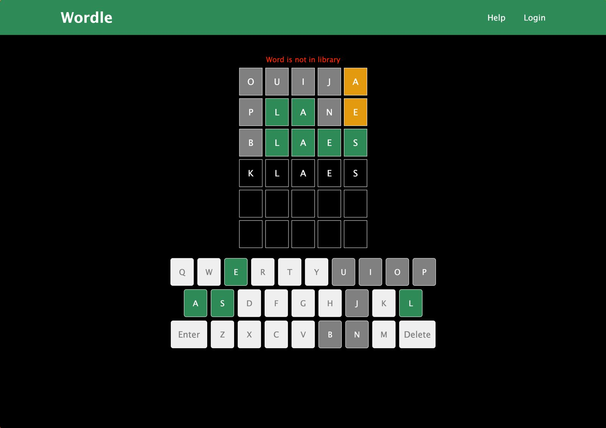
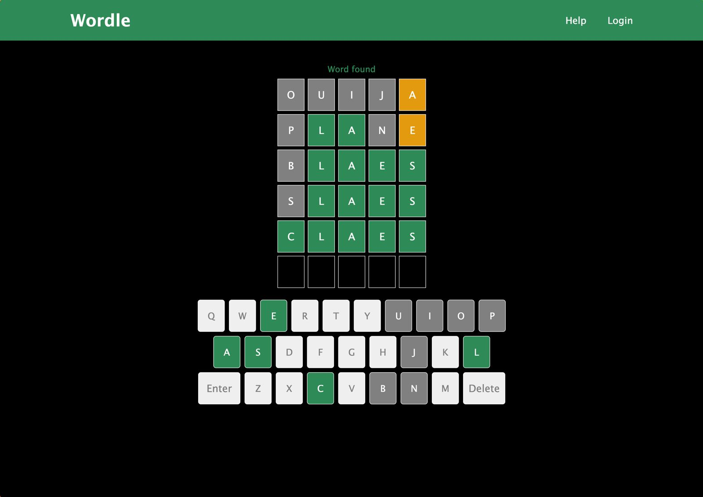

# Wordle Clone 🎯

A full-stack clone of the classic Wordle game made popular by The New York Times. Guess the correct five-letter word in six attempts, with color-coded hints to guide you!

## 🧠 Gameplay Logic

* You get **6 attempts** to guess the correct **5-letter** word.
* After each guess:

  * 🟩 **Green**: Correct letter in the correct position.
  * 🟨 **Yellow**: Correct letter in the wrong position.
  * ⬛ **Gray**: Letter not in the word at all.
* Words with **duplicate letters** are handled precisely to avoid false positives.
* The mystery word changes **daily** based on the date.

## 🌐 Live Demo

👉 [Play here](https://wordle-clone-nine-brown.vercel.app)

## 🛠️ Tech Stack

* **Frontend:** React.js, Vite, CSS
* **Backend:** Node.js, Express
* **Word Data:** Loaded from a `words.txt` file in the backend’s public directory

## 📦 Features

* Clean UI with keyboard support
* Daily word generated via a date-based hashing algorithm
* Backend validation to check if guesses are valid 5-letter words
* Responsive UI feedback and error messages for invalid or out-of-dictionary guesses

## 🔍 API Overview

### `POST /api/word`

Sends a guessed word to the backend and receives position feedback.

**Request Body:**

```json
{
  "word": "ouija"
}
```

**Response:**

```json
{
  "status": "success",
  "message": "Word processed",
  "wordFound": true,
  "answer": {
    "4": "position"
  }
}
```

* `wordFound`: Indicates if the guessed word exists in the dictionary.
* `answer`: Key-value pairs where keys are character positions and values are "correct" or "position".

## 🖼️ Screenshots

### Desktop View


### Wrong Guess



### Game Completion




## 🚀 Running Locally

### Backend

```bash
cd backend
npm install
npm start
```

### Frontend

```bash
cd frontend
npm install
npm run dev
```

## 🧪 Development Notes

* The word of the day is derived deterministically via hashing today’s date to get a consistent word index.
* Logs print the current test word in development for easy debugging.

## 📁 File Structure Overview

* `backend/public/words.txt`: List of valid 5-letter words
* `backend/server.js`: Main Express server logic
* `frontend/`: React frontend interface

## 🎯 Audience

Ideal for fans of brain games, puzzles, and daily challenges.

---

Happy guessing! 🧩
